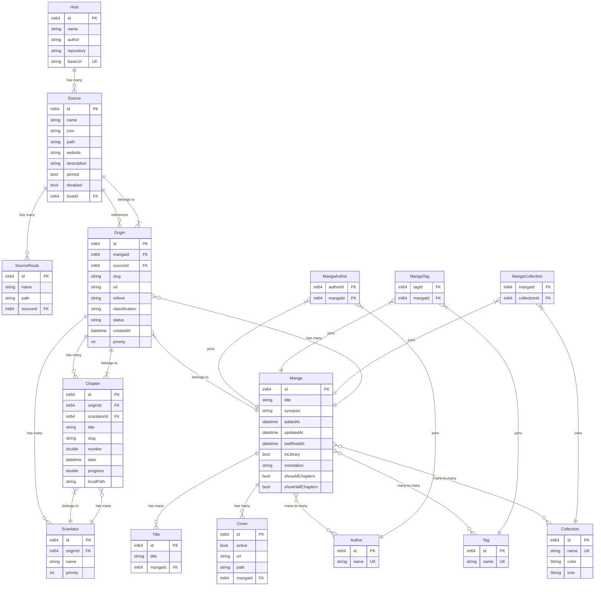

# Change Log
All notable changes to this project will be documented in this file.
 
The format is based on [Keep a Changelog](http://keepachangelog.com/)
and this project adheres to [Semantic Versioning](http://semver.org/).

## [1.0.3] - 2025-06-05

### Database Migration
- **Version**: 1.0.2 → 1.0.3
- **Tables Affected**: `manga`
- **Migration**: Add `lastReadAt` column to manga table
- **Reason**: Track when manga was last read for better library organization and sorting

### Changed
- PATCH Added `lastReadAt` property to manga table to track reading history
- Added database migration from 1.0.2 to 1.0.3 for manga table

---

## [1.0.2] - 2025-06-04

### Database Migration
- **Version**: 1.0.1 → 1.0.2
- **Tables Affected**: `collection`
- **Migration**: Add icon and color props to collection
- **Reason**: Introducing collection grouping functionality, adding some personalisation fields

### Changed
- PATCH Updated collection with added `icon` and `color` properties
- Added according database migration from 1.0.1 to 1.0.2 for affected tables

---

## [1.0.1] - 2025-01-07

### Database Migration
- **Version**: 1.0.0 → 1.0.1
- **Tables Affected**: `manga`
- **Migration**: Updates all manga entries to set their `updatedAt` timestamp based on the most recent chapter date across all origins
- **Reason**: Ensures manga update timestamps accurately reflect content updates

### Changed
- PATCH Updated manga `updatedAt` property to reflect the most recent chapter date from all associated origins
- Added database migration to retroactively update existing manga entries with correct `updatedAt` values

## [1.0.0] - 2025-01-01
 
### Added
- Initial release with core manga reading functionality
- Database schema v1.0.0 with support for manga, chapters, sources, and metadata

---

## Database Schema

For the current database schema, see [DATABASE.md](./DATABASE.md) or view below:

Entity Relationship Diagram

