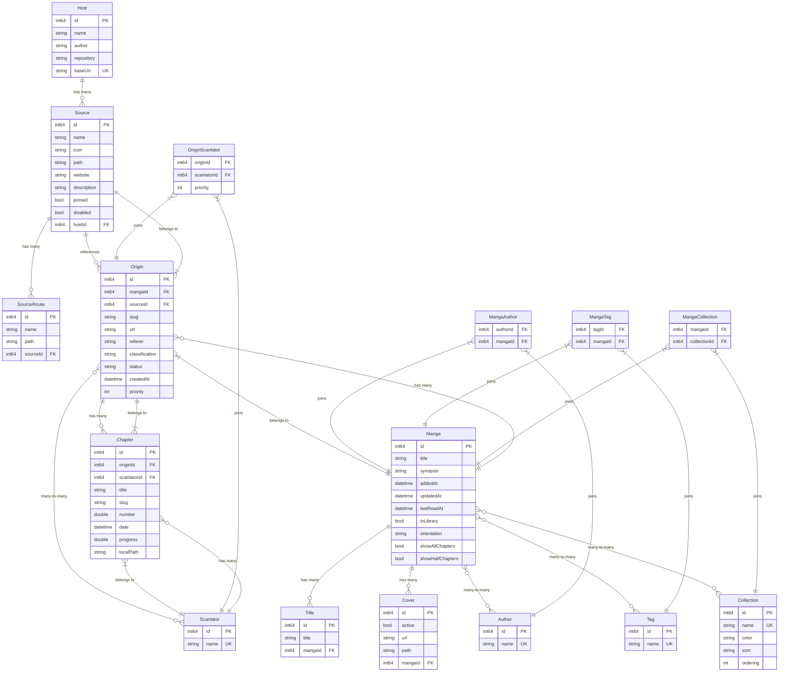

# Alethia Database Schema

## Overview

Alethia uses SQLite with GRDB as the database layer. The schema is designed to support a flexible manga reading application with multiple content sources, tracking capabilities, and user library management.

**Current Version**: 1.0.4

## Entity Relationship Diagram

### Version 1.0.4

