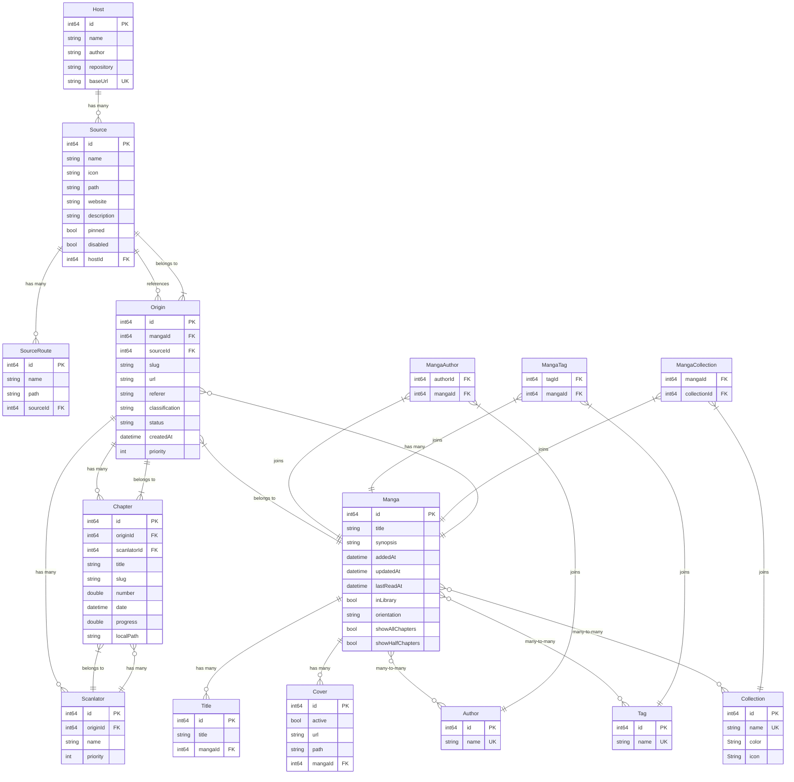

# Alethia Database Schema

## Overview

Alethia uses SQLite with GRDB as the database layer. The schema is designed to support a flexible manga reading application with multiple content sources, tracking capabilities, and user library management but this file will only document at specific versions how the schema changes.

**Current Version**: 1.0.3

## Entity Relationship Diagram

### Version 1.0.3

## Version History

### Changes from 1.0.2 to 1.0.3
- Added `lastReadAt` column to `Manga` table to track reading history

### Changes from 1.0.1 to 1.0.2
- Added `color` and `icon` columns to `Collection` table for personalization

### Changes from 1.0.0 to 1.0.1
- Added migration to update manga `updatedAt` timestamps based on most recent chapter dates
