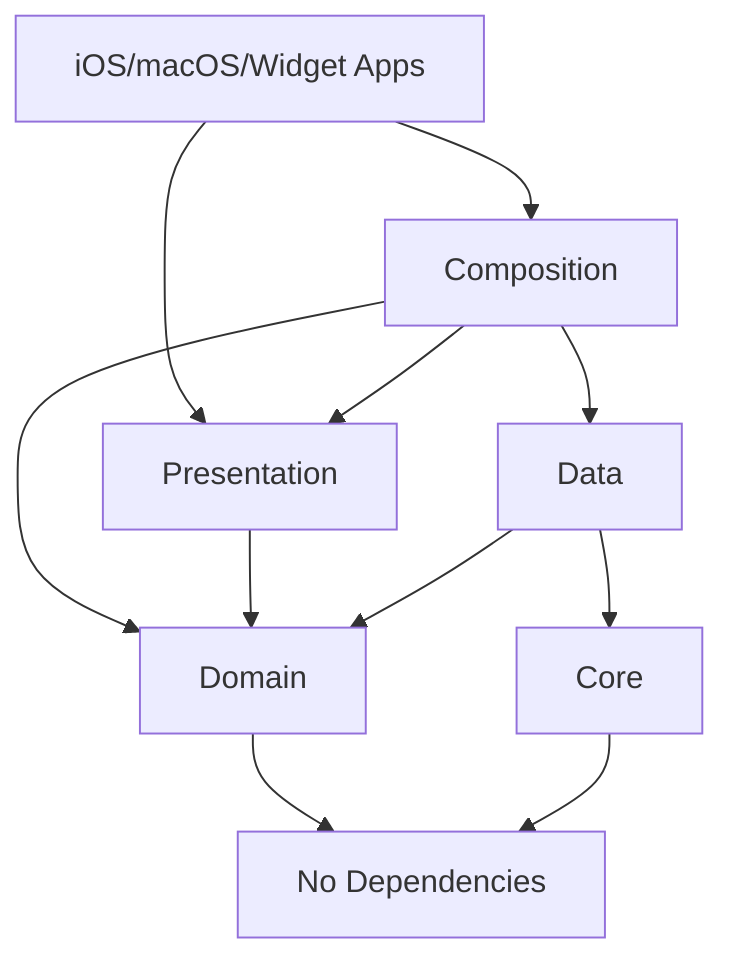

# Alethia Architecture Guide

## Overview

This project follows a **Composition-based Architecture** with clean separation between business logic, data access, presentation, and dependency wiring. The architecture enables code reuse across multiple targets (iOS, macOS, watchOS, widgets) while maintaining clean, testable code.

## Package Structure

```
apps/ios/
├── Shared/
│   ├── Core/          # Shared utilities and constants
│   ├── Domain/        # Business entities and protocols
│   ├── Data/          # Repository implementations and database
│   ├── Presentation/  # Views and ViewModel protocols
│   └── Composition/   # Dependency injection and ViewModel implementations
└── ios/               # iOS app target
```

## Package Dependencies



### Dependency Rules

- **Domain** has NO dependencies (pure business logic)
- **Core** has NO dependencies (shared utilities)
- **Data** depends on Domain and Core
- **Presentation** depends ONLY on Domain
- **Composition** depends on ALL packages
- **App Targets** depend on Composition and Presentation

## Package Responsibilities

### Core

**Purpose**: Shared utilities and constants used across the app

**Contains**:

- File paths and directory management
- App group identifiers
- System constants
- Extension utilities

**Example**:

```swift
// Core/Sources/Constants/Constants+Paths.swift
public extension Constants {
    enum Paths {
        public static var database: URL { }
        public static var downloads: URL { }
    }
}
```

### Domain

**Purpose**: Pure business logic and entities

**Contains**:

- Business entities (Manga, Chapter, Source, etc.)
- Use case protocols (interfaces only)
- Business rules and value objects
- Common enums (Status, Classification, etc.)

**Rules**:

- NO external dependencies
- NO UI/Framework imports (no SwiftUI, UIKit)
- Pure Swift only

**Example**:

```swift
// Domain/Sources/Entities/Manga.swift
public struct Manga {
    public let id: Int64
    public let title: String
    public let chapters: [Chapter]
}

// Domain/Sources/UseCases/FetchMangaUseCase.swift
public protocol FetchMangaUseCase {
    func execute(id: Int64) async throws -> Manga
}
```

### Data

**Purpose**: Data access layer and use case implementations

**Contains**:

- Database configuration (GRDB)
- Repository implementations
- Network services
- Use case concrete implementations
- Data models (Records)
- Migrations

**Example**:

```swift
// Data/Sources/UseCases/FetchMangaUseCaseImpl.swift
public final class FetchMangaUseCaseImpl: FetchMangaUseCase {
    private let database: DatabaseConfiguration

    public func execute(id: Int64) async throws -> Manga {
        // implementation
    }
}
```

### Presentation

**Purpose**: UI components and ViewModel protocols

**Contains**:

- SwiftUI Views
- ViewModel protocols (not implementations)
- View-specific models
- UI utilities
- Resolver protocol

**Rules**:

- Views ONLY know about ViewModel protocols
- NO concrete ViewModel implementations
- NO knowledge of data layer
- Views get ViewModels via Resolver

**Example**:

```swift
// Presentation/Sources/ViewModels/LibraryViewModel.swift
public protocol LibraryViewModel: ObservableObject {
    var mangaItems: [MangaItem] { get }
    func loadLibrary() async
}

// Presentation/Sources/Views/LibraryView.swift
public struct LibraryView: View {
    @StateObject private var viewModel: any LibraryViewModel

    public init() {
        // resolver provides the concrete implementation
        self._viewModel = StateObject(wrappedValue: Resolver.current.resolveLibraryViewModel())
    }
}
```

### Composition

**Purpose**: Wires everything together

**Contains**:

- Concrete ViewModel implementations
- ViewModelResolver implementations
- Dependency injection setup
- Use case provider
- Factory implementations

**Example**:

```swift
// Composition/Sources/ViewModels/LibraryViewModelImpl.swift
final class LibraryViewModelImpl: LibraryViewModel {
    @Published private(set) var mangaItems: [MangaItem] = []
    private let fetchLibraryUseCase: FetchLibraryUseCase

    func loadLibrary() async {
        // implementation
    }
}

// Composition/Sources/IOSViewModelResolver.swift
final class IOSViewModelResolver: ViewModelResolver {
    func resolveLibraryViewModel() -> any LibraryViewModel {
        LibraryViewModelImpl(
            fetchLibraryUseCase: useCaseProvider.fetchLibrary
        )
    }
}
```

## The Resolver Pattern

The app uses a **Resolver Pattern** for dependency injection. This provides clean view initialization without parameter passing.

### How It Works

1. **Each target sets up its resolver once at app launch:**

```swift
// iOS/Main.swift
@main
struct AlethiaApp: App {
    init() {
        Resolver.setup(IOSViewModelResolver())
    }
}
```

2. **Views get their ViewModels from the resolver:**

```swift
public struct MangaDetailView: View {
    @StateObject private var viewModel: any MangaDetailViewModel

    public init(mangaId: Int64) {
        self._viewModel = StateObject(
            wrappedValue: Resolver.current.resolveMangaDetailViewModel(mangaId: mangaId)
        )
    }
}
```

3. **Different targets provide different implementations:**

```swift
// iOS target
Resolver.setup(IOSViewModelResolver())

// macOS target
Resolver.setup(MacViewModelResolver())

// Widget target
Resolver.setup(WidgetViewModelResolver())
```

## Navigation Pattern

Navigation uses SwiftUI's native navigation with data passing:

```swift
// views only pass data (IDs), not ViewModels
NavigationLink {
    MangaDetailView(mangaId: manga.id)  // only pass the ID
} label: {
    MangaCard(manga: manga)
}
```

Each view is responsible for getting its own ViewModel from the resolver.

## Adding New Features

### 1. Define Domain Entity

```swift
// Domain/Sources/Entities/NewEntity.swift
public struct NewEntity {
    public let id: Int64
    // properties
}
```

### 2. Create Use Case Protocol

```swift
// Domain/Sources/UseCases/NewEntityUseCase.swift
public protocol FetchNewEntityUseCase {
    func execute() async throws -> [NewEntity]
}
```

### 3. Implement Use Case

```swift
// Data/Sources/UseCases/FetchNewEntityUseCaseImpl.swift
public final class FetchNewEntityUseCaseImpl: FetchNewEntityUseCase {
    public func execute() async throws -> [NewEntity] {
        // implementation
    }
}
```

### 4. Define ViewModel Protocol

```swift
// Presentation/Sources/ViewModels/NewEntityViewModel.swift
public protocol NewEntityViewModel: ObservableObject {
    var items: [NewEntity] { get }
    func load() async
}
```

### 5. Create View

```swift
// Presentation/Sources/Views/NewEntityView.swift
public struct NewEntityView: View {
    @StateObject private var viewModel: any NewEntityViewModel

    public init() {
        self._viewModel = StateObject(
            wrappedValue: Resolver.current.resolveNewEntityViewModel()
        )
    }
}
```

### 6. Implement ViewModel

```swift
// Composition/Sources/ViewModels/NewEntityViewModelImpl.swift
final class NewEntityViewModelImpl: NewEntityViewModel {
    @Published private(set) var items: [NewEntity] = []
    private let useCase: FetchNewEntityUseCase

    func load() async {
        items = try await useCase.execute()
    }
}
```

### 7. Add to Resolver

```swift
// Composition/Sources/IOSViewModelResolver.swift
extension IOSViewModelResolver {
    func resolveNewEntityViewModel() -> any NewEntityViewModel {
        NewEntityViewModelImpl(useCase: useCaseProvider.fetchNewEntity)
    }
}
```

## Testing Strategy

### Unit Tests

```swift
// test use cases with mock repositories
func testFetchMangaUseCase() async {
    let mockRepo = MockMangaRepository()
    let useCase = FetchMangaUseCaseImpl(repository: mockRepo)

    let result = try await useCase.execute(id: 1)
    XCTAssertEqual(result.id, 1)
}
```

### View Tests

```swift
// test views with mock resolver
func testLibraryView() {
    Resolver.setup(MockViewModelResolver())
    let view = LibraryView()
    // test view behavior
}
```

### ViewModel Tests

```swift
// test viewmodels with mock use cases
func testLibraryViewModel() async {
    let mockUseCase = MockFetchLibraryUseCase()
    let viewModel = LibraryViewModelImpl(fetchLibraryUseCase: mockUseCase)

    await viewModel.loadLibrary()
    XCTAssertFalse(viewModel.mangaItems.isEmpty)
}
```

## Best Practices

### DO ✅

- Keep Domain layer pure (no external dependencies)
- Define protocols in Domain/Presentation, implementations in Data/Composition
- Use resolver for ViewModel creation
- Pass only data (IDs) between views
- Create focused, single-responsibility use cases
- Test each layer independently

### DON'T ❌

- Import Data layer in Presentation
- Create ViewModels inside other ViewModels
- Pass ViewModels between views
- Put business logic in ViewModels (use use cases)
- Access database directly from ViewModels
- Mix UI code in Domain layer

## Common Patterns

### Nested Views with Own ViewModels

```swift
struct ParentView: View {
    var body: some View {
        VStack {
            // nested view gets its own viewmodel from resolver
            ChildView(dataId: 123)

            // another nested view
            AnotherChildView(dataId: 456)
        }
    }
}

struct ChildView: View {
    @StateObject private var viewModel: any ChildViewModel

    init(dataId: Int64) {
        self._viewModel = StateObject(
            wrappedValue: Resolver.current.resolveChildViewModel(dataId: dataId)
        )
    }
}
```

### Async Data Loading

```swift
public struct SomeView: View {
    @StateObject private var viewModel: any SomeViewModel

    var body: some View {
        content
            .task {
                await viewModel.load()
            }
            .refreshable {
                await viewModel.refresh()
            }
    }
}
```

### Error Handling

```swift
final class ViewModelImpl: SomeViewModel {
    @Published var error: Error?

    func load() async {
        do {
            items = try await useCase.execute()
        } catch {
            self.error = error
        }
    }
}
```

## Target-Specific Implementations

Each target can provide different implementations while reusing the same views:

```swift
// iOS: Full-featured implementation
final class IOSLibraryViewModel: LibraryViewModel {
    // full database, network sync, etc.
}

// Widget: Lightweight implementation
final class WidgetLibraryViewModel: LibraryViewModel {
    // only reads from shared container
}

// macOS: Desktop-optimized implementation
final class MacLibraryViewModel: LibraryViewModel {
    // different layout logic, keyboard shortcuts
}
```

All targets use the same `LibraryView` but get different behaviors through their resolvers.

## Tradeoffs Accepted

This architecture makes deliberate tradeoffs for simplicity:

- **Runtime errors over compile-time errors**: Resolver setup issues appear at runtime
- **Hidden dependencies**: Views don't explicitly declare their ViewModel needs
- **Global state**: Resolver is essentially a singleton
- **Testing requires setup**: Must setup resolver before testing views

These tradeoffs are acceptable for the benefits of:

- Clean view APIs without parameter passing
- Easy handling of deeply nested views
- Simple, consistent patterns
- Good reusability across targets
